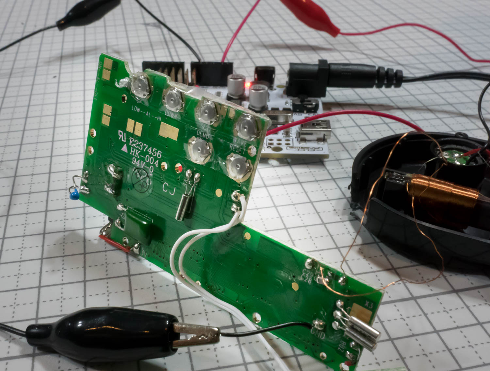
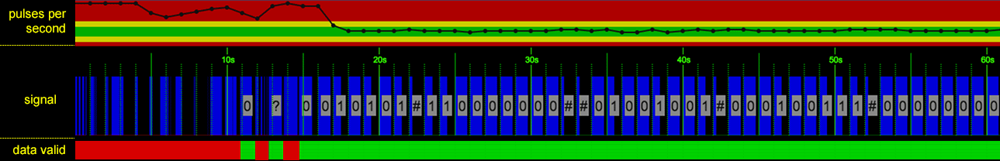
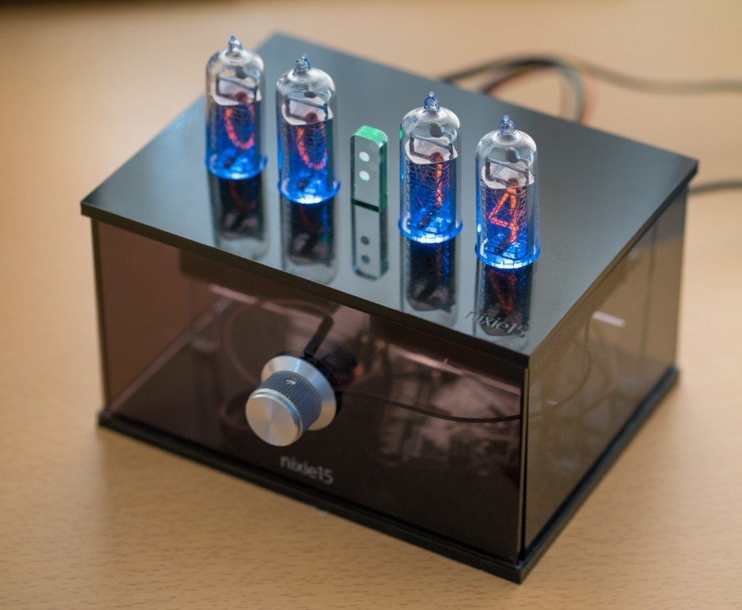

# jjy-radioparser

C++ code to parse the Japanese JJY radio signal using a Seiko SM9501A decoder IC

## Background

The Japanese government maintains two AM transmitters that combine to cover the entirety of the country. These
transmitters send a time signal that can be used by
clocks and other devices to automatically set their time.

I discovered this by accident when I found a radio in
a store that claimed to set itself and cost USD $8.

## Process

I tore apart the clock to find the RF radio and decoder
chip so I could sniff the signals

Wrote the software found here to reverse the signals and
how to interface with the decoder chip.

Then built a self-setting Nixie Tube clock

# Source

The C++ code in jjy.cpp was written for the Arduino environment and a very cheap Atmel microcontroller. It runs in about 1K each of RAM/FLASH.

The process of reverse engineering the protocol etc.
is documented here [Pulling Time from the Sky](https://atomsandelectrons.com/time-from-the-sky/)
